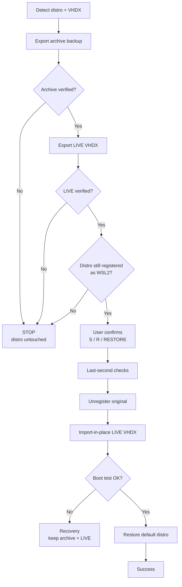

# WSL Safe Backup / Move / Restore

**English** · [Tiếng Việt](README.vi.md)

Safely back up, move, and restore a WSL2 distribution — designed for Microsoft Store-installed distros (e.g. `Ubuntu-24.04`) whose VHDX lives in a hard-to-reach Store-managed location.

The tool follows a strict safety model: it never overwrites files, never unregisters a distro before two independently verified VHDX exports exist, and only enters the destructive path after an explicit, typed confirmation.

A companion launcher (`run-wsl-safe.cmd`) parses the PowerShell script for syntax errors **before** executing anything, so a broken edit can never start a WSL operation.

## Features

- **Backup only** — export an independent, timestamped VHDX archive; the original distro is never unregistered.
- **Safe move / restore** — move a Store-managed WSL2 distro to a location you control (e.g. `D:\WSL\Ubuntu-24.04`) while always keeping an independent archive backup.
- **Pre-flight validation** — disk-space checks with a safety margin, WSL capability checks (`--export --vhd`, `--import-in-place`), writability probes, and VHDX sanity checks before anything destructive.
- **Danger-zone gates** — a dedicated confirmation step plus a final type-`RESTORE` confirmation immediately before `wsl --unregister`.
- **Post-restore verification** — registration check, WSL2 version check, boot test (`/bin/true`), and default-distro restoration.
- **Crash-safe design** — if any step fails before unregister, the original distro is untouched; if import fails after unregister, both the archive backup and the exported live VHDX remain for manual recovery.

## Repository layout

| Path | Purpose |
| --- | --- |
| `wsl-safe-backup-restore.ps1` | The backup / move / restore engine |
| `run-wsl-safe.cmd` | Launcher with mandatory PowerShell syntax pre-check |

## Requirements

- Windows 10/11 (or Windows Server) with WSL enabled and a WSL2 distro installed.
- A WSL version that supports `--export --vhd` and `--import-in-place` (recent WSL from the Microsoft Store; check with `wsl --version`).
- PowerShell 5.1 or newer (included with Windows).
- For **SAFE MOVE / RESTORE**: a destination drive with at least **1.2× the current VHDX size** of free space (configurable), plus space for the archive backup.

## Quick start

1. Clone or download the repository.
2. (Recommended) Double-click `run-wsl-safe.cmd`. The launcher validates the PowerShell syntax first and refuses to run the script if parsing fails.
3. Or run the script directly:

   ```powershell
   powershell -NoProfile -ExecutionPolicy Bypass -File .\wsl-safe-backup-restore.ps1
   ```

4. In the menu, choose:

   - `1` — BACKUP ONLY (never unregisters anything)
   - `2` — SAFE MOVE / RESTORE (full flow)
   - `Q` — EXIT

## Configuration

Edit the configuration block at the top of `wsl-safe-backup-restore.ps1`:

| Setting | Default | Description |
| --- | --- | --- |
| `$Distro` | `Ubuntu-24.04` | Target WSL2 distro name |
| `$BackupRoot` | `E:\wsl-backup` | Folder for independent archive backups (must be on a drive with free space) |
| `$SpaceSafetyFactor` | `1.20` | Free-space margin multiplier applied to size estimates |

## How the move works

1. Detect the current distro + VHDX.
2. Export an independent archival backup.
3. Verify the archival backup.
4. Export a second VHDX to the desired LIVE location.
5. Verify the live VHDX.
6. Confirm the original distro still exists and is WSL2.
7. Require explicit user confirmation (menu + typed `RESTORE`).
8. Unregister the original distro (the only destructive operation).
9. `wsl --import-in-place` the new LIVE VHDX.
10. Verify registration and WSL2 version.
11. Boot-test the restored distro.
12. Restore the default-distro setting when applicable.



See [docs/SAFETY_MODEL.md](docs/SAFETY_MODEL.md) for the full safety model and the failure/recovery matrix.

## Safety guarantees

- Archive backup and LIVE VHDX are **never** the same file.
- Existing files are **never** silently overwritten — the script refuses to start if the destination already exists.
- Unregister is **blocked** unless all pre-flight and last-second checks pass.
- If export or validation fails, unregister is **not** executed.
- If import fails after unregister, the archive backup and exported live VHDX remain, and the manual `wsl --import-in-place` command is printed for recovery.

## Troubleshooting

- **`--import-in-place` not advertised** — your WSL version is too old. Update WSL from the Microsoft Store (`wsl --update`) and retry.
- **`Current ext4.vhdx was not found`** — the script cannot detect a direct VHDX under the registry BasePath (newer Store distros can use an abstracted storage model). The script stops rather than guess; its export path still works because it relies on `wsl --export --vhd`.
- **MOVE refuses because the LIVE directory is not empty** — choose a new/empty directory; nothing is overwritten.
- **Not enough free space** — the destination needs at least `1.2 × estimated size`; free up space or change the backup/live drive.

## Development

The documentation ships with a validation toolchain:

```powershell
npm install
npm run validate
```

`npm run validate` parses every Mermaid diagram, checks Markdown code fences and internal links, and runs the PowerShell syntax check without executing the script.

GitHub Actions run the same checks on every push and pull request, plus an English / Vietnamese documentation sync check:

```powershell
npm run check:docs-sync
npm run ci
```

See [CONTRIBUTING.md](CONTRIBUTING.md) for details.

## Contributing

See [CONTRIBUTING.md](CONTRIBUTING.md).

## Security

See [SECURITY.md](SECURITY.md) for the security policy and how to report issues.

## License

[MIT](LICENSE)
