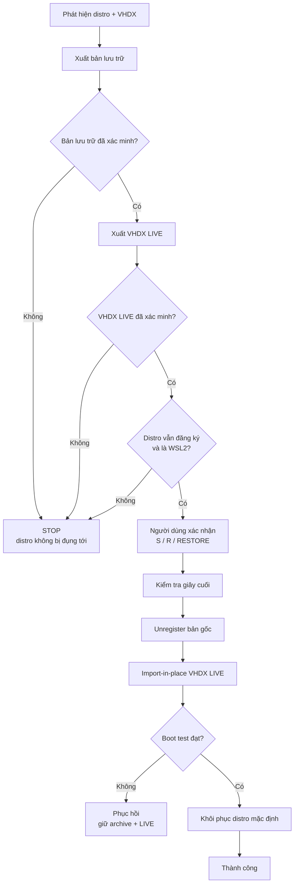

# WSL Safe Backup / Move / Restore

[English](README.md) · **Tiếng Việt**

Sao lưu, di chuyển và khôi phục bản phân phối WSL2 một cách an toàn — được thiết kế cho distro cài từ Microsoft Store (ví dụ `Ubuntu-24.04`) có VHDX nằm trong thư mục khó truy cập do Store quản lý.

Công cụ tuân theo mô hình an toàn nghiêm ngặt: không bao giờ ghi đè file, không unregister distro trước khi có **hai bản VHDX độc lập đã được kiểm tra**, và chỉ bước vào bước phá hủy sau khi có xác nhận tường minh, gõ bằng tay.

Launcher đi kèm (`run-wsl-safe.cmd`) phân tích cú pháp script PowerShell **trước khi** thực thi, nên một file bị sửa hỏng không bao giờ có thể khởi động thao tác WSL.

## Tính năng

- **Chỉ sao lưu (Backup only)** — xuất một bản lưu trữ VHDX độc lập có timestamp; distro gốc không bao giờ bị unregister.
- **Di chuyển / khôi phục an toàn (Safe move / restore)** — chuyển distro WSL2 do Store quản lý đến vị trí bạn kiểm soát (ví dụ `D:\WSL\Ubuntu-24.04`) trong khi luôn giữ một bản lưu trữ độc lập.
- **Kiểm tra trước khi chạy** — kiểm tra dung lượng đĩa có hệ số an toàn, kiểm tra khả năng WSL (`--export --vhd`, `--import-in-place`), thử quyền ghi và kiểm tra sơ bộ VHDX trước bất kỳ thao tác phá hủy nào.
- **Cổng chặn vùng nguy hiểm** — một bước xác nhận riêng cộng với xác nhận cuối gõ chính xác `RESTORE` ngay trước `wsl --unregister`.
- **Xác minh sau khôi phục** — kiểm tra đăng ký, kiểm tra phiên bản WSL2, boot test (`/bin/true`) và khôi phục cài đặt distro mặc định.
- **Thiết kế chống sự cố** — nếu bất kỳ bước nào thất bại trước khi unregister, distro gốc không bị đụng tới; nếu import thất bại sau khi unregister, cả bản lưu trữ và bản VHDX live đã xuất vẫn còn để khôi phục thủ công.

## Cấu trúc kho lưu trữ

| Đường dẫn | Mục đích |
| --- | --- |
| `wsl-safe-backup-restore.ps1` | Engine sao lưu / di chuyển / khôi phục |
| `run-wsl-safe.cmd` | Launcher có kiểm tra cú pháp PowerShell bắt buộc |

## Yêu cầu hệ thống

- Windows 10/11 (hoặc Windows Server) có bật WSL và cài một distro WSL2.
- Phiên bản WSL hỗ trợ `--export --vhd` và `--import-in-place` (WSL mới từ Microsoft Store; kiểm tra bằng `wsl --version`).
- PowerShell 5.1 trở lên (đi kèm Windows).
- Với **SAFE MOVE / RESTORE**: ổ đĩa đích cần ít nhất **1.2× kích thước VHDX hiện tại** dung lượng trống (có thể cấu hình), cộng thêm chỗ cho bản lưu trữ.

## Bắt đầu nhanh

1. Clone hoặc tải kho lưu trữ về.
2. (Khuyến nghị) Nhấp đúp `run-wsl-safe.cmd`. Launcher kiểm tra cú pháp PowerShell trước và từ chối chạy script nếu phân tích thất bại.
3. Hoặc chạy script trực tiếp:

   ```powershell
   powershell -NoProfile -ExecutionPolicy Bypass -File .\wsl-safe-backup-restore.ps1
   ```

4. Trong menu, chọn:

   - `1` — BACKUP ONLY (không bao giờ unregister gì cả)
   - `2` — SAFE MOVE / RESTORE (luồng đầy đủ)
   - `Q` — EXIT

## Cấu hình

Sửa khối cấu hình ở đầu `wsl-safe-backup-restore.ps1`:

| Thiết lập | Mặc định | Mô tả |
| --- | --- | --- |
| `$Distro` | `Ubuntu-24.04` | Tên distro WSL2 mục tiêu |
| `$BackupRoot` | `E:\wsl-backup` | Thư mục chứa các bản lưu trữ độc lập (phải nằm trên ổ có dung lượng trống) |
| `$SpaceSafetyFactor` | `1.20` | Hệ số an toàn dung lượng trống áp dụng cho ước tính kích thước |

## Cách thao tác di chuyển hoạt động

1. Phát hiện distro + VHDX hiện tại.
2. Xuất một bản lưu trữ độc lập.
3. Kiểm tra bản lưu trữ.
4. Xuất VHDX thứ hai đến vị trí LIVE mong muốn.
5. Kiểm tra VHDX live.
6. Xác nhận distro gốc vẫn tồn tại và là WSL2.
7. Yêu cầu xác nhận tường minh từ người dùng (menu + gõ `RESTORE`).
8. Unregister distro gốc (thao tác phá hủy duy nhất).
9. `wsl --import-in-place` bản VHDX LIVE mới.
10. Xác minh đăng ký và phiên bản WSL2.
11. Boot-test distro đã khôi phục.
12. Khôi phục cài đặt distro mặc định khi phù hợp.



Xem [docs/SAFETY_MODEL.vi.md](docs/SAFETY_MODEL.vi.md) để biết mô hình an toàn đầy đủ và ma trận lỗi/phục hồi.

## Các đảm bảo an toàn

- Bản lưu trữ và VHDX LIVE **không bao giờ** là cùng một file.
- File hiện có **không bao giờ** bị ghi đè âm thầm — script từ chối chạy nếu đích đã tồn tại.
- Unregister **bị chặn** trừ khi tất cả kiểm tra trước khi chạy và kiểm tra giây cuối đều đạt.
- Nếu xuất hoặc xác minh thất bại, unregister **không** được thực thi.
- Nếu import thất bại sau khi unregister, bản lưu trữ và VHDX live đã xuất vẫn còn, và lệnh `wsl --import-in-place` thủ công được in ra để phục hồi.

## Xử lý sự cố

- **Không thấy `--import-in-place`** — phiên bản WSL của bạn quá cũ. Cập nhật WSL từ Microsoft Store (`wsl --update`) và thử lại.
- **`Current ext4.vhdx was not found`** — script không phát hiện được VHDX trực tiếp dưới BasePath trong registry (distro Store mới có thể dùng mô hình lưu trữ trừu tượng). Script dừng thay vì đoán; đường xuất của nó vẫn hoạt động vì dựa vào `wsl --export --vhd`.
- **MOVE từ chối vì thư mục LIVE không trống** — hãy chọn thư mục mới/trống; không có gì bị ghi đè.
- **Không đủ dung lượng trống** — đích cần ít nhất `1.2 × kích thước ước tính`; giải phóng dung lượng hoặc đổi ổ cho backup/live.

## Phát triển

Tài liệu đi kèm bộ công cụ kiểm tra:

```powershell
npm install
npm run validate
```

`npm run validate` phân tích mọi sơ đồ Mermaid, kiểm tra code fence và link nội bộ trong Markdown, đồng thời chạy kiểm tra cú pháp PowerShell mà không thực thi script. Xem [CONTRIBUTING.vi.md](CONTRIBUTING.vi.md) để biết chi tiết.

## Đóng góp

Xem [CONTRIBUTING.vi.md](CONTRIBUTING.vi.md).

## Bảo mật

Xem [SECURITY.vi.md](SECURITY.vi.md) để biết chính sách bảo mật và cách báo cáo lỗi.

## Giấy phép

[MIT](LICENSE)
