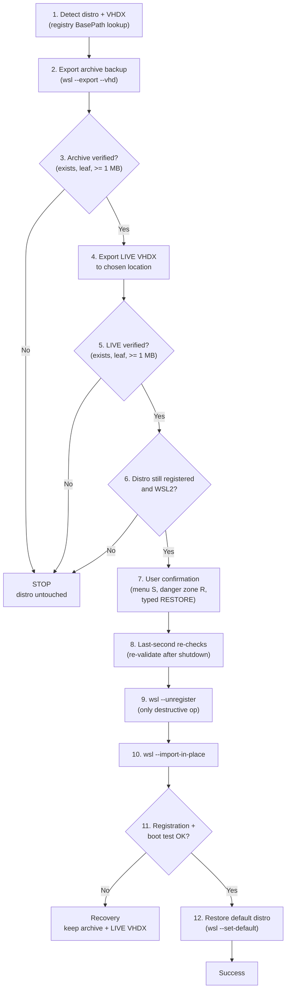
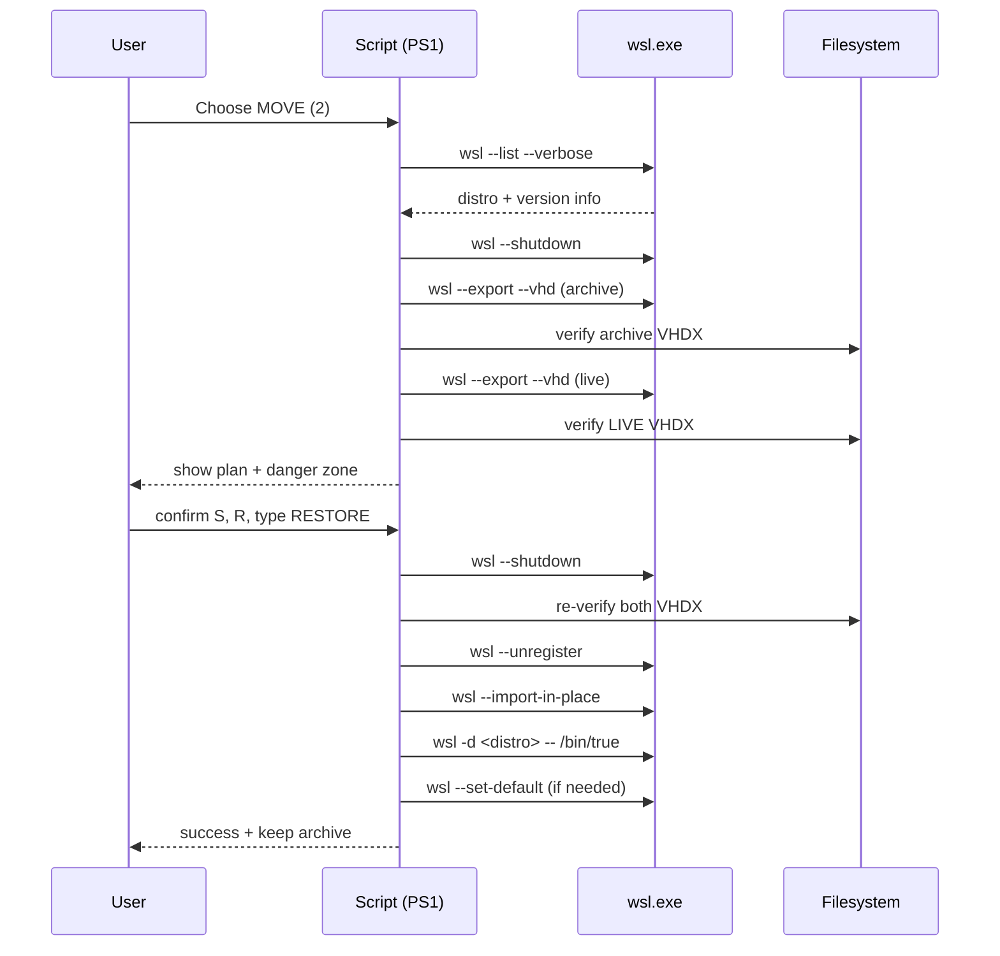
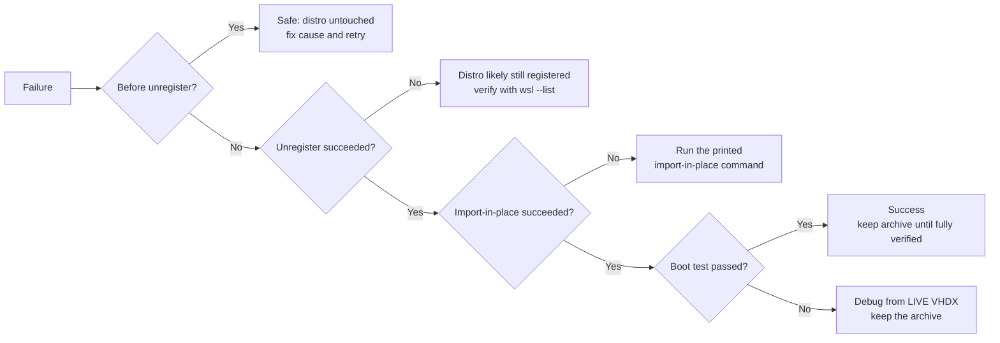
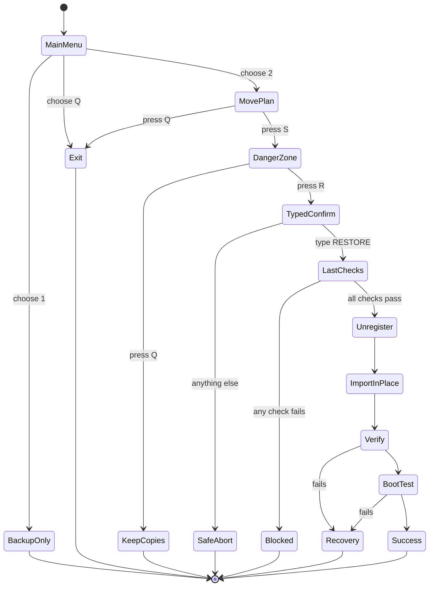

# Safety Model

This document explains the safety guarantees of WSL Safe Backup / Move / Restore. It is intended for users, reviewers, and future contributors. If you plan to change any behavior described here, read this first.

## Core principles

1. **No silent data loss.** The only destructive operation is `wsl --unregister <distro>`, and it is never executed until multiple independent verifications pass.
2. **Never overwrite.** If a destination file or directory already exists, the script stops. Nothing is ever replaced without explicit confirmation.
3. **Verify before destroying.** Every artifact that must survive the operation is checked for existence and minimum size before the destructive step, and checked *again* immediately before it.
4. **Two independent copies.** For MOVE, the archive backup and the live VHDX are always separate files — never the same path, never the same directory — so a single-file failure cannot strand you.
5. **Explicit point of no return.** Entering the destructive path requires a menu confirmation, a dedicated danger-zone confirmation, a typed `RESTORE` confirmation, and last-second checks.

## Why Store distros need this

Distros installed from the Microsoft Store live under a Store-managed directory (registered in `HKCU:\Software\Microsoft\Windows\CurrentVersion\Lxss`). Copying files out of that location while the distro is registered is risky and unsupported. The script therefore uses the supported `wsl --export <distro> <file> --vhd` path for both the archive backup and the new live VHDX, then `wsl --import-in-place` to register the live VHDX at the chosen location — without copying it.

## The 12-step MOVE flow

| # | Step | Guard |
| --- | --- | --- |
| 1 | Detect current distro + VHDX | Registry `BasePath` lookup; script stops if it cannot detect (no guessing) |
| 2 | Export independent archival backup | `wsl --export --vhd` to `$BackupRoot`; refuses if file exists |
| 3 | Verify archival backup | Exists, is a leaf file, size ≥ 1 MB |
| 4 | Export live VHDX to chosen location | Same export path; refuses if directory is non-empty or file exists |
| 5 | Verify live VHDX | Exists, leaf, size ≥ 1 MB |
| 6 | Confirm original distro still registered and WSL2 | `wsl --list` + version parsing |
| 7 | Explicit user confirmation | Menu (`S`), danger-zone menu (`R`), typed `RESTORE`) |
| 8 | Last-second re-checks | Both VHDX re-validated after final shutdown |
| 9 | Unregister original distro | The single destructive operation |
| 10 | `wsl --import-in-place` live VHDX | Registration of the exported file, no copy |
| 11 | Verify registration + WSL2 + boot test | `wsl --list`, version check, `/bin/true` |
| 12 | Restore default-distro setting | `wsl --set-default` when the moved distro was default |

### End-to-end sequence

## Failure and recovery matrix

| Failure point | What the script does | State of your data | Recovery |
| --- | --- | --- | --- |
| Export of archive fails | Removes incomplete file, stops | Original distro untouched | Fix cause, retry |
| Archive validation fails | Stops | Original distro untouched; partial export removed | Fix cause, retry |
| Live export or validation fails | Stops | Original distro untouched; archive backup exists | Fix cause, retry |
| Unregister fails | Stops with instructions | Original distro (likely) still registered; both VHDX exist | Verify with `wsl --list`, do not delete backups |
| Distro still listed after unregister | Stops with instructions | Both VHDX exist | Manual investigation before deleting anything |
| Import-in-place fails | Prints manual command | Original registration gone; archive + live VHDX exist | Run the printed `wsl --import-in-place` command |
| Boot test fails | Stops | Distro registered; archive + live VHDX exist | Keep the archive, debug from the live VHDX |

The script cannot restore a deleted distro from nothing: recovery always relies on the archive backup and/or the exported live VHDX. Keep the archive backup until you have fully verified your files and applications after a successful move.

## Confirmation chain (in detail)

1. **Main menu** — the user explicitly chooses `2` for MOVE (or `1` for backup only).
2. **Safe move plan** — the full plan (distro, original VHDX, archive path, live path, default distro) is displayed; the user must press `S` to continue or `Q` to exit.
3. **Danger zone** — before any destructive action, the exact command (`wsl --unregister <distro>`) is shown with both backup paths; the user must press `R` to continue or `Q` to keep both exported files.
4. **Typed confirmation** — the user must type exactly `RESTORE` (case-sensitive). Anything else aborts safely.
5. **Last-second checks** — after the final `wsl --shutdown`, both VHDX files are re-validated and the distro must still be registered before unregister executes.

## What the script guarantees (and what it does not)

**Guaranteed:**

- Existing files are never silently overwritten.
- Archive and live VHDX are never the same file; a same-path check blocks unregister if they unexpectedly resolve identically.
- Unregister is blocked unless pre-flight and last-second checks pass.
- If anything fails before unregister, unregister is not executed.

**Not guaranteed:**

- Protection against filesystem corruption, disk failure, or antivirus interference with WSL/VHDX files.
- Recovery if the archive and live VHDX are both manually deleted or corrupted.
- Operation on distros the user renames/edits while the script runs (the script re-checks, but an external actor can always race the checks).

## Configuration impact on safety

- `$BackupRoot` must be on a drive with free space; the script probes writability and refuses to continue otherwise.
- `$SpaceSafetyFactor` (default `1.20`) only affects the free-space estimate, not the verification logic. Lowering it does not weaken any destruction guard; it only reduces the space margin.
- `$Distro` selects the target. The script verifies the distro exists and is WSL2 before doing anything else.
