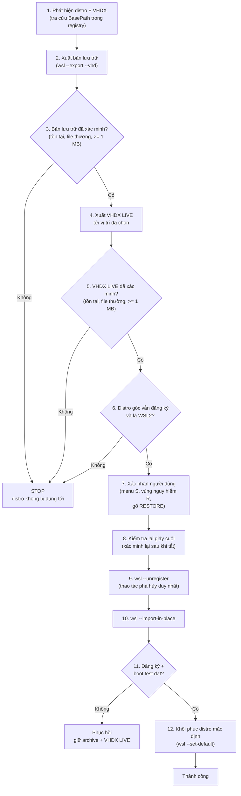
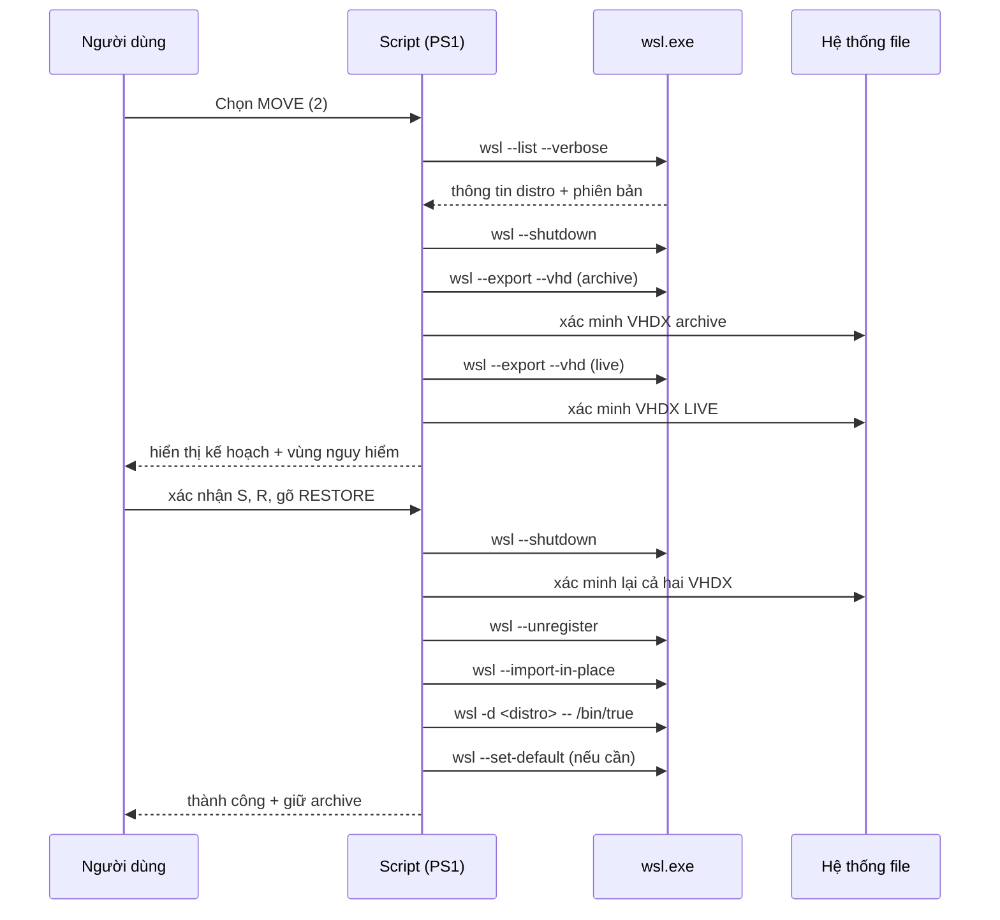
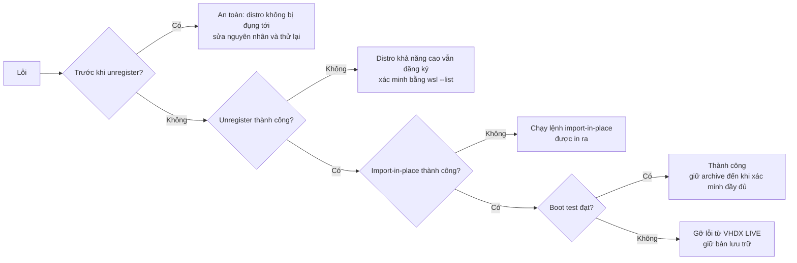
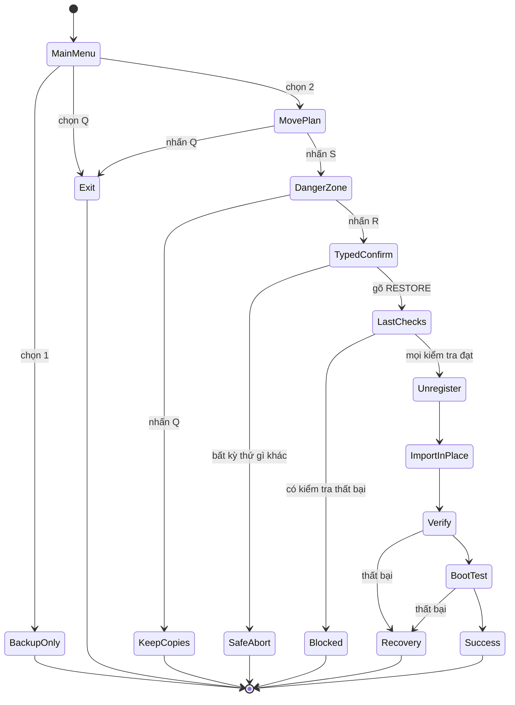

# Mô hình an toàn

Tài liệu này giải thích các đảm bảo an toàn của WSL Safe Backup / Move / Restore. Nó dành cho người dùng, người review và các nhà đóng góp tương lai. Nếu bạn định thay đổi bất kỳ hành vi nào được mô tả ở đây, hãy đọc tài liệu này trước.

## Nguyên tắc cốt lõi

1. **Không mất dữ liệu âm thầm.** Thao tác phá hủy duy nhất là `wsl --unregister <distro>`, và nó không bao giờ được thực thi cho đến khi nhiều xác minh độc lập đạt yêu cầu.
2. **Không bao giờ ghi đè.** Nếu file hoặc thư mục đích đã tồn tại, script dừng lại. Không có gì bị thay thế mà không có xác nhận tường minh.
3. **Xác minh trước khi phá hủy.** Mọi tạo phẩm phải sống sót qua thao tác đều được kiểm tra tồn tại và kích thước tối thiểu trước bước phá hủy, và được kiểm tra *lần nữa* ngay trước nó.
4. **Hai bản sao độc lập.** Với MOVE, bản lưu trữ và VHDX live luôn là các file riêng biệt — không bao giờ cùng đường dẫn, không bao giờ cùng thư mục — nên lỗi của một file không thể mắc kẹt bạn.
5. **Điểm không thể quay lại tường minh.** Bước vào đường phá hủy cần xác nhận menu, xác nhận vùng nguy hiểm, gõ xác nhận `RESTORE`, và kiểm tra giây cuối.

## Vì sao distro Store cần điều này

Distro cài từ Microsoft Store nằm trong thư mục do Store quản lý (được đăng ký tại `HKCU:\Software\Microsoft\Windows\CurrentVersion\Lxss`). Sao chép file ra khỏi vị trí đó khi distro còn đăng ký là rủi ro và không được hỗ trợ. Script do đó dùng đường `wsl --export <distro> <file> --vhd` được hỗ trợ cho cả bản lưu trữ và VHDX live mới, rồi `wsl --import-in-place` để đăng ký VHDX live tại vị trí đã chọn — không cần sao chép.

## Luồng MOVE 12 bước

| # | Bước | Rào chặn |
| --- | --- | --- |
| 1 | Phát hiện distro + VHDX hiện tại | Tra cứu `BasePath` trong registry; script dừng nếu không phát hiện được (không đoán) |
| 2 | Xuất bản lưu trữ độc lập | `wsl --export --vhd` tới `$BackupRoot`; từ chối nếu file tồn tại |
| 3 | Xác minh bản lưu trữ | Tồn tại, là file thường, kích thước ≥ 1 MB |
| 4 | Xuất VHDX live tới vị trí đã chọn | Cùng đường xuất; từ chối nếu thư mục không trống hoặc file tồn tại |
| 5 | Xác minh VHDX live | Tồn tại, file thường, kích thước ≥ 1 MB |
| 6 | Xác nhận distro gốc vẫn đăng ký và là WSL2 | `wsl --list` + phân tích phiên bản |
| 7 | Xác nhận tường minh từ người dùng | Menu (`S`), menu vùng nguy hiểm (`R`), gõ `RESTORE`) |
| 8 | Kiểm tra lại giây cuối | Cả hai VHDX được xác minh lại sau lần tắt cuối |
| 9 | Unregister distro gốc | Thao tác phá hủy duy nhất |
| 10 | `wsl --import-in-place` VHDX live | Đăng ký file đã xuất, không sao chép |
| 11 | Xác minh đăng ký + WSL2 + boot test | `wsl --list`, kiểm tra phiên bản, `/bin/true` |
| 12 | Khôi phục cài đặt distro mặc định | `wsl --set-default` khi distro đã chuyển từng là mặc định |

### Trình tự từ đầu đến cuối

## Ma trận lỗi và phục hồi

| Điểm thất bại | Script làm gì | Trạng thái dữ liệu của bạn | Phục hồi |
| --- | --- | --- | --- |
| Xuất bản lưu trữ thất bại | Gỡ file chưa hoàn chỉnh, dừng | Distro gốc không bị đụng tới | Sửa nguyên nhân, thử lại |
| Xác minh bản lưu trữ thất bại | Dừng | Distro gốc không bị đụng tới; bản xuất một phần bị gỡ | Sửa nguyên nhân, thử lại |
| Xuất hoặc xác minh live thất bại | Dừng | Distro gốc không bị đụng tới; bản lưu trữ tồn tại | Sửa nguyên nhân, thử lại |
| Unregister thất bại | Dừng kèm hướng dẫn | Distro gốc (khả năng cao) vẫn đăng ký; cả hai VHDX tồn tại | Xác minh bằng `wsl --list`, không xóa bản sao lưu |
| Distro vẫn hiển thị sau unregister | Dừng kèm hướng dẫn | Cả hai VHDX tồn tại | Điều tra thủ công trước khi xóa bất cứ thứ gì |
| Import-in-place thất bại | In lệnh thủ công | Đăng ký gốc đã mất; bản lưu trữ + VHDX live tồn tại | Chạy lệnh `wsl --import-in-place` được in ra |
| Boot test thất bại | Dừng | Distro đã đăng ký; bản lưu trữ + VHDX live tồn tại | Giữ bản lưu trữ, gỡ lỗi từ VHDX live |

Script không thể khôi phục một distro đã xóa từ hư không: phục hồi luôn dựa vào bản lưu trữ và/hoặc VHDX live đã xuất. Hãy giữ bản lưu trữ cho đến khi bạn đã xác minh đầy đủ file và ứng dụng sau một lần di chuyển thành công.

## Chuỗi xác nhận (chi tiết)

1. **Menu chính** — người dùng chọn tường minh `2` cho MOVE (hoặc `1` cho chỉ sao lưu).
2. **Kế hoạch di chuyển an toàn** — kế hoạch đầy đủ (distro, VHDX gốc, đường lưu trữ, đường live, distro mặc định) được hiển thị; người dùng phải nhấn `S` để tiếp tục hoặc `Q` để thoát.
3. **Vùng nguy hiểm** — trước bất kỳ thao tác phá hủy nào, lệnh chính xác (`wsl --unregister <distro>`) được hiển thị cùng cả hai đường backup; người dùng phải nhấn `R` để tiếp tục hoặc `Q` để giữ cả hai file đã xuất.
4. **Xác nhận gõ tay** — người dùng phải gõ chính xác `RESTORE` (phân biệt hoa thường). Bất kỳ thứ gì khác đều hủy an toàn.
5. **Kiểm tra giây cuối** — sau lần `wsl --shutdown` cuối, cả hai file VHDX được xác minh lại và distro phải vẫn đăng ký trước khi unregister thực thi.

## Điều script đảm bảo (và điều nó không đảm bảo)

**Đảm bảo:**

- File hiện có không bao giờ bị ghi đè âm thầm.
- Bản lưu trữ và VHDX live không bao giờ là cùng một file; kiểm tra cùng đường dẫn chặn unregister nếu chúng trùng nhau một cách bất ngờ.
- Unregister bị chặn trừ khi kiểm tra trước khi chạy và kiểm tra giây cuối đạt yêu cầu.
- Nếu bất kỳ điều gì thất bại trước unregister, unregister không được thực thi.

**Không đảm bảo:**

- Bảo vệ khỏi hỏng hệ thống file, lỗi ổ đĩa hoặc can thiệp của phần mềm diệt virus với các file WSL/VHDX.
- Phục hồi nếu cả bản lưu trữ và VHDX live đều bị xóa hoặc hỏng thủ công.
- Hoạt động trên distro mà người dùng đổi tên/sửa trong lúc script chạy (script có kiểm tra lại, nhưng tác nhân bên ngoài luôn có thể chạy đua với các kiểm tra).

## Ảnh hưởng của cấu hình đến an toàn

- `$BackupRoot` phải nằm trên ổ có dung lượng trống; script thử quyền ghi và từ chối tiếp tục nếu không đạt.
- `$SpaceSafetyFactor` (mặc định `1.20`) chỉ ảnh hưởng ước tính dung lượng trống, không ảnh hưởng logic xác minh. Hạ thấp nó không làm yếu bất kỳ rào chặn phá hủy nào; nó chỉ giảm biên dung lượng.
- `$Distro` chọn mục tiêu. Script xác minh distro tồn tại và là WSL2 trước khi làm bất cứ điều gì khác.
